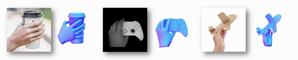
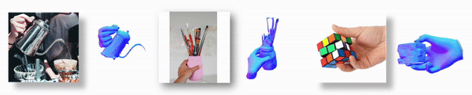
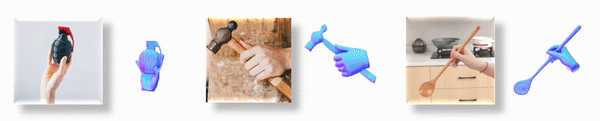
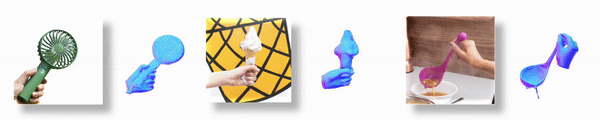

# EasyHOI: Unleashing the Power of Large Models for Reconstructing Hand-Object Interactions in the Wild
[](./LICENSE)
[](https://arxiv.org/abs/2411.14280)

<div style="text-align: center;">
  
</div>
<div style="text-align: center;">
  
</div>
<div style="text-align: center;">
  
</div>
<div style="text-align: center;">
  
</div>
<div style="text-align: center;">
  
</div>

EasyHOI is a pipeline designed for reconstructing hand-object interactions from single-view images.

---
## ✅ TODO
- [ ] Integrate the code execution environments into one.
- [ ] Complete a one-click demo.
---

## 📑 Table of Contents
1. [Installation](#installation)
2. [Usage](#usage)
    - [Initial Reconstruction of Hand and Object](#preprocess)
    - [Prior-guided Optimization](#optimization)
3. [Acknowledgements](#acknowledgements)

## 🛠️ Installation

```
conda create -n easyhoi python=3.9
conda activate easyhoi
conda install -y pytorch=1.13.0 torchvision pytorch-cuda=11.6 -c pytorch -c nvidia
conda install -c fvcore -c iopath -c conda-forge fvcore iopath
conda env update --file environment.yaml
```
Install pytorch3d follow the [official instruction](https://github.com/facebookresearch/pytorch3d/blob/main/INSTALL.md).


Install HaMeR and ViTPose:
```
cd third_party
git clone https://github.com/ViTAE-Transformer/ViTPose.git
cd ./hamer
pip install -e .[all]
cd ../ViTPose
pip install -v -e .
```

Install chamfer_distance:
```
pip install git+'https://github.com/otaheri/chamfer_distance'
```

Install mano:
```
pip install git+'https://github.com/otaheri/MANO'
pip install git+'https://github.com/lixiny/manotorch'
```

Install nvdiffrast:
```
pip install git+'https://github.com/NVlabs/nvdiffrast.git'
```

### Additional Environments
Since I haven’t resolved the conflict between the environments yet, it’s necessary to create several virtual environments called afford_diff, lisa, and instantmesh. Please refer to the links below to set up these environments.

- afford_diff: https://github.com/NVlabs/affordance_diffusion/blob/master/docs/install.md

- lisa: https://github.com/dvlab-research/LISA
- instantmesh: https://github.com/TencentARC/InstantMesh?tab=readme-ov-file

Thanks to the authors of these wonderful projects. I will resolve the environment conflicts as soon as possible and provide a more user-friendly demo.


## 🚀  Usage

### Preprocess

"""Initial Reconstruction of Hand and Object"""

Place your images in ./data/images. Alternatively, you can use a different path, but make sure it includes a folder named "images".

#### Step 1: Hand pose estimation, get hand mask from hamer
```
conda activate easyhoi
python preprocess/recon_hand.py --data_dir ./data/

```

#### Step 2: Segment hand mask and object mask from image before inpainting
```
conda activate lisa
cd third_party/LISA
CUDA_VISIBLE_DEVICES=0 python chat_arctic.py --version='xinlai/LISA-13B-llama2-v1-explanatory' --precision='fp16' --seg_hand --skip --load_in_8bit --data_dir ./data/

CUDA_VISIBLE_DEVICES=0 python chat_arctic.py --version='xinlai/LISA-13B-llama2-v1-explanatory' --precision='fp16' --skip --load_in_8bit --data_dir ./data/
```

#### Step 3: Inpaint
```
conda activate afford_diff
python preprocess/inpaint.py --data_dir ./data/ --save_dir ./data/obj_recon/ --img_folder images --inpaint --skip
```


#### Step 4: Segment inpainted obj get the inpainted mask 

```
conda activate easyhoi
python preprocess/seg_image.py --data_dir ./data/
```

#### Step 5: Reconstruct obj
use InstantMesh
```
cd third_party/InstantMesh/
conda activate instantmesh
export data_dir=./data/obj_recon/input_for_lrm/
export out_dir=./data/obj_recon/results/instantmesh

python run_easyhoi.py configs/instant-mesh-large.yaml ${data_dir} --output_path ${out_dir}
```

#### Step 6: fix the object mesh, get watertight mesh
```
conda activate easyhoi
python preprocess/resample_mesh.py --data_dir ./data [--resample]
```

### Optimization
```
conda activate easyhoi
python src/optim_easyhoi.py -cn optim_teaser

```

## 🙏 Acknowledgements

We would like to express our gratitude to the authors and contributors of the following projects:
- [HaMeR](https://github.com/geopavlakos/hamer/tree/main)
- [AffordanceDiffusion](https://github.com/NVlabs/affordance_diffusion/blob/master/docs/install.md)

- [LISA](https://github.com/dvlab-research/LISA)
- [InstantMesh](https://github.com/TencentARC/InstantMesh?tab=readme-ov-file)
- [IHOI](https://github.com/JudyYe/ihoi)
- [MOHO](https://github.com/ZhangCYG/MOHO)

## Citation
If you find our work useful, please consider citing us using the following BibTeX entry:
```
@article{liu2024easyhoi,
  title={EasyHOI: Unleashing the Power of Large Models for Reconstructing Hand-Object Interactions in the Wild},
  author={Liu, Yumeng and Long, Xiaoxiao and Yang, Zemin and Liu, Yuan and Habermann, Marc and Theobalt, Christian and Ma, Yuexin and Wang, Wenping},
  journal={arXiv preprint arXiv:2411.14280},
  year={2024}
}
```